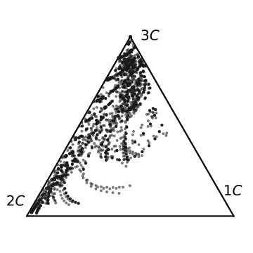
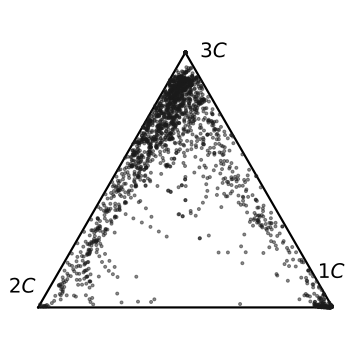
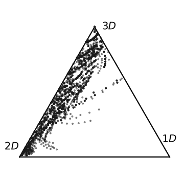
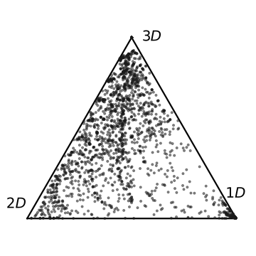

# rdt-sd

Generates rapidly distorted turbulence velocity spectra on spherical t-design
wavevector grids, either as an ensemble of sampled cases or a single case.


## Pipeline

| Stage | Module | What it does |
| --- | --- | --- |
| Sampling | `src/sampler.py` | Draws 7 parameters via a Sobol sequence — 4 shaping the mean velocity gradient (strain/rotation blend), 3 the Coriolis vector. Ensemble runs only; single-case runs supply `grad_u`/`omega` directly. |
| Grids | `src/spherical_designs.py` | Loads the spherical t-design wavevector grid. Checks `grids/` first; on a miss, downloads from UNSW and caches. |
| Solving | `src/rdt_solver.py` | Integrates the RDT ODE system with JAX/diffrax, using adaptive `dopri5` or fixed-step `rk4`. |
| Saving | `scripts/launcher.py` | Writes to `results/<run_name>/`: one `phi_batch_{i}.npy` per batch for ensembles, or a single `phi_single.npy`. |
| Postprocessing | `scripts/postprocessing.py` | Reads saved phi arrays, computes structure tensors (`src/tensor_utils.py`) and the early-stopping index per case (`src/earlystopping.py`), and writes a pickled tensors dict plus an `.npy` es_array. |
| ML dataset | `scripts/ml_postprocessing.py` | Normalizes the structure tensors by `q2`, truncates each case at its early-stopping index, flattens case and time into one sample axis, attaches the per-case velocity gradients and Coriolis terms, drops unrealizable samples, and plots the resulting anisotropy spread on the barycentric triangle. |
| Anisotropy visualization | `scripts/barycentric_plots_w_coriolis.py` | Maps the R_ij and D_ij anisotropies onto the barycentric (Lumley) triangle, truncating each case at its early-stopping index. |

## Usage

Run from the repo root.

### Simulating 

Edit `configs/launcher_config.toml`, then:

```
python -m scripts.launcher
```

### Postprocessing 

Point it at the saved phi arrays; multiple paths are treated as
batch shards of one ensemble and concatenated:

```
python -m scripts.postprocessing \
  --phi_arrays results/<run_name>/phi_batch_{0..BATCH_SIZE-1}.npy \
  --structure_tensors_output results/<run_name>/structure_tensors.pkl \
  --es_array_output results/<run_name>/es_array.npy \
  --es_degree et
```

`--es_threshold` defaults to `1.6e-4`. Add `--es_only` to skip the structure
tensor computation and only refresh es_array, which also drops the need for
`--structure_tensors_output`. `--es_degree` is based on the spherical design grid, 
and must be set to `2*(t//2)`. which is the closest even integer halfer from `t`
which is the spherical design degree. BATCH_SIZE is the number of batches used in 
`launcher_config.toml`.  

### Building the ML dataset

Point it at the postprocessed outputs and at the launcher config that generated
the run:

```
python -m scripts.ml_postprocessing \
  --structure_tensors results/<run_name>/structure_tensors.pkl \
  --es_array results/<run_name>/es_array.npy \
  --config configs/launcher_config.toml \
  --output_dir results/<run_name>/ml
```

Writes one `.npy` per array — `q2`, `r_ij`, `d_ij`, `q_ijk`, `qs_ijk`, `m_ijpq`,
`ms_ijpq`, `l_ijpq`, `j_ijrpq`, `gradU`, and `corU` when the run used Coriolis —
all sharing a trailing sample axis. The mean velocity gradients and Coriolis terms
are not saved by the launcher, so they are re-sampled from `--config`; it must be
the config that produced the run, or the cases will not line up.

Alongside the arrays it writes `anisotropy_plot_Rij.svg` and
`anisotropy_plot_Dij.svg`, showing the spread of the dataset's anisotropy states on
the barycentric (Lumley) triangle. Datasets run to tens of thousands of samples, so
only every `BARY_PLOTTING_FREQUENCY`-th sample is drawn; edit that module constant
to change the density.

### Visualizing Anisotropy 


```
python -m scripts.barycentric_plots_w_coriolis
```

This reads cached ensembles from `results/runs/` for the fixed cases
`coriolis_rdt_jcp` and `no_coriolis_rdt_jcp`, expecting
`structure_tensors_<case>.pkl` and `<case>_es_array.npy`. Postprocessed outputs
must be placed there under those names before plotting.

## Config reference

`configs/launcher_config.toml` has the following args: 

- `[run]` — `name`, the output directory under `results/`.
- `[run_type]` — `ensemble` mode switch. `true` samples and solves a batch of
  cases via `launch_parallel`; `false` solves the one case in `[single]` via
  `launch_rdt_single`.
- `[params]` — args shared by both modes: `num_time_steps`, `sd_degree`,
  `st_max`, and `solver` (`"dopri5"` or `"rk4"`).
- `[ensemble]` — ensemble-only args: `num_samples`, `batch_size`, `seed`, and
  `use_coriolis`. `use_coriolis` is the Coriolis switch: `true` samples Coriolis
  vectors and applies them, `false` runs without rotation. Set `[run] name` per
  case so the two ensembles land in separate directories.
- `[single]` — single-case-only args: `grad_u`, shape (3, 3), and `omega`,
  shape (3,), defaulting to zeros.

## Scripts

Supplementary figure and analysis scripts, each run as `python -m scripts.<name>`:

| Script | Purpose | Output |
| --- | --- | --- |
| `visualize_sd.py` | Renders t-design grids as 3D scatters on a unit sphere (`--degrees`, default `5 19 45`). | `results/spherical_designs/k_spherical_designs_t{t}.svg` |
| `convergence_plots.py` | Convergence against analytical solutions, with normalized time steps and with spherical t-design degree. | `results/convergence_plots/*.svg` |
| `earlystopping_thresholds.py` | Stopping thresholds from lmax energy fractions and M6 errors of Axisymmetric expansion. | `results/es_thresholds/*.svg` |
| `verify_es.py` | Validates the Stopping criterion on pure shear. | `results/verify_es/*.csv` |
| `push_to_1c.py` | Pushes anisotropy toward the 1C limit using frame rotation (`--regenerate` to rebuild the cache). | `results/push_1c/*.svg` |

## Anisotropy spreads

Two 200-case ensembles over the same sampled velocity gradients, run with
`use_coriolis` off and on, so the columns below isolate the effect of frame
rotation. Every dot is one realizable anisotropy state on the barycentric
(Lumley) triangle, and each case is truncated at its early-stopping index.

|  | Without Coriolis | With Coriolis |
| --- | --- | --- |
| **R_ij** (componentality, corners `1C`/`2C`/`3C`) |  |  |
| **D_ij** (dimensionality, corners `1D`/`2D`/`3D`) |  |  |

Regenerate with `python -m scripts.barycentric_plots_w_coriolis`, as described
under [Visualizing Anisotropy](#visualizing-anisotropy).
